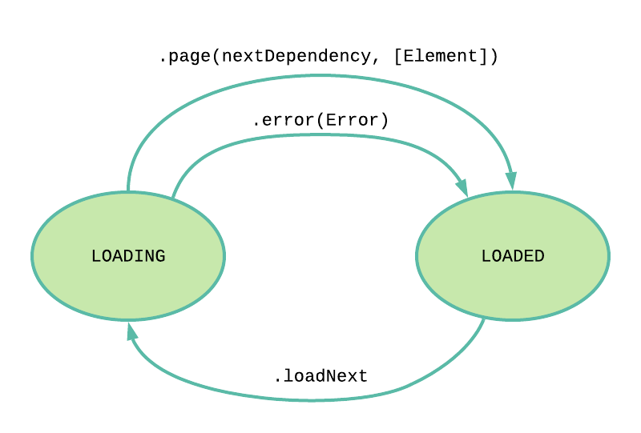

# RxPaginationFeedback
 [](https://github.com/apple/swift-package-manager) [](https://travis-ci.com/fabfelici/RxPaginationFeedback) [](https://codecov.io/gh/fabfelici/RxPaginationFeedback)

Generic RxSwift operator to easily interact with paginated APIs. Based on [RxFeedback](https://github.com/NoTests/RxFeedback.swift).

## Design



```swift
public typealias PageProvider<PageDependency, Element> = (PageDependency) -> Observable<Page<PageDependency, Element>>

public static func paginationSystem<PageDependency: Equatable, Element>(
    scheduler: ImmediateSchedulerType,
    initialDependency: PageDependency,
    loadNext: Observable<Void>,
    pageProvider: @escaping PageProvider<PageDependency, Element>
) -> Observable<PaginationState<PageDependency, Element>>
```

## Features
* Simple state machine to represent pagination use cases.
* Reusable pagination logic. No need to duplicate state across different screens with paginated apis.
* Observe state to react to loading event, latest error and changes on the list of elements.

# Examples

## Simple [Reqres](https://reqres.in/) example

```swift
struct ReqresResponse: Decodable {
    let data: [User]
}

struct User: Decodable {
    let firstName: String
    let lastName: String
}

let decoder = JSONDecoder()
decoder.keyDecodingStrategy = .convertFromSnakeCase

let state = Driver.paginationSystem(
    initialDependency: 0,
    loadNext: loadNext
) { page -> Observable<PageResponse<Int, User>> in

    let urlRequest = URLRequest(url: URL(string: "https://reqres.in/api/users?page=\(page)")!)

    return URLSession.shared.rx.data(request: urlRequest)
        .compactMap {
            (try? decoder.decode(ReqresResponse.self, from: $0).data)
                .map {
                    Page(nextDependency: page + 1, elements: $0)
                }
        }
}

state.map { $0.elements }
    .drive(tableView.rx.items(cellIdentifier: "Cell", cellType: UITableViewCell.self)) { index, item, cell in
        cell.textLabel?.text = "\(item.firstName) - \(item.lastName)"
    }
    .disposed(by: disposeBag)
```

[More examples](https://github.com/fabfelici/RxPaginationFeedback/blob/master/Examples/Examples)

